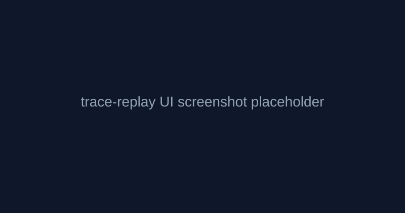

# trace-replay

Local-first agent trace observability focused on **real-time trace replay** and **prompt diff across runs**.

## Mission

trace-replay does one thing extremely well: debug agent trajectories with a scrub-through UI that feels like a video player.

## v0.1 architecture

- `sdk/`: Python decorator + exporters (SQLite default, OTEL HTTP optional)
- `server/`: FastAPI ingestion/query/diff/stream API
- `web/`: React + Vite + Tailwind UI with TraceTimeline + PromptDiff
- `examples/`: OpenAI-like, Anthropic-like, MCP-like toy agents

## Screenshot



## Quickstart

```bash
# Python environment with 3.12+
cd sdk && pip install -e .
cd ../server && pip install -e .

# Start API server + open browser
trace-replay serve
```

```bash
# run example and produce local trace_replay.db
PYTHONPATH=sdk/src python examples/openai_agent/main.py
sqlite3 trace_replay.db 'select id,name,status from traces;'
```

## Web app

```bash
cd web
npm install
npm run dev
```

## Comparison stance

trace-replay is not a Langfuse/Helicone/Phoenix replacement. It is a focused debugging tool that can integrate with broader observability stacks via OTEL-style export/import.

## Dev commands

```bash
make dev
make test
make build
```
